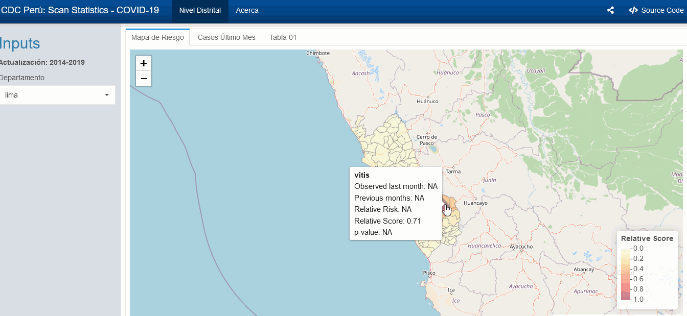
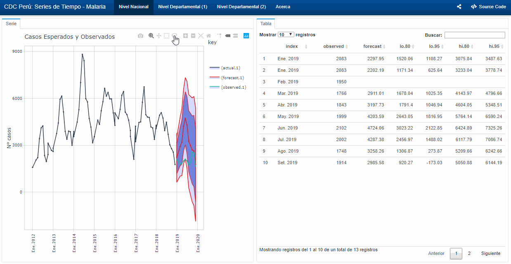
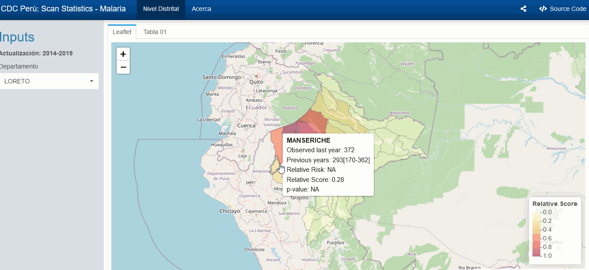

```{r setup, include = FALSE}
knitr::opts_chunk$set(
  collapse = TRUE,
  comment = "#>"
)
```

## Tableros

### COVID-19

#### Incidencia y Número reproductivo efectivo (Rt) 

- A nivel Nacional y Departamental con 
casos [Confirmados](https://github.com/avallecam/shiny-server/blob/master/c19/covidrtnac/index.Rmd) 
y [Sospechosos](https://github.com/avallecam/shiny-server/blob/master/c19/covidsymptrtnac/index.Rmd)

{ width=85% }

- A nivel Distrital con 
casos [Confirmados](https://github.com/avallecam/shiny-server/blob/master/c19/covidrtdep/index.Rmd)
y [Sospechosos](https://github.com/avallecam/shiny-server/blob/master/c19/covidsymptrtdep/index.Rmd)

{ width=85% }

#### Sistema de Reporte Temprano de Aberraciones (EARS)

- A nivel Departamental y Distrital con
casos [Confirmados](https://github.com/avallecam/shiny-server/blob/master/c19/covidearsa/index.Rmd) y 
[Sospechosos](https://github.com/avallecam/shiny-server/blob/master/c19/covidsymptearsa/index.Rmd)

{ width=85% }


#### Áreas calientes por Expectation-based Scan Statistic

- Por Departamento y Riesgo a nivel Distrital con
casos [Confirmados](https://github.com/avallecam/shiny-server/blob/master/c19/covidscanr/index.Rmd) y 
[Sospechosos](https://github.com/avallecam/shiny-server/blob/master/c19/covidsymptscanr/index.Rmd)

{ width=85% }

### Malaria

- Aberraciones en [Series de Tiempo](https://github.com/avallecam/shiny-server/blob/master/vig/pltime/index.Rmd) a
nivel Departamental

{ width=85% }

- [Áreas calientes](https://github.com/avallecam/shiny-server/blob/master/vig/plscan/index.Rmd) por 
Departamento y Riesgo a nivel Distrital

{ width=85% }

## Contacto

Dirección de Vigilancia en Salud Pública